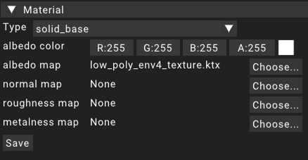

# Material

Materials are some of the key assets for the renderer.
A material describes how the surface of an object looks and its behavior when hit by light.

The actual description for the surface behavior is described in a shader program.
These shader programs are defined in the renderer and exposed as MaterialTypes.
Each material has a MaterialType assigned to it that describes what shader to use to render an object that uses this material.

MaterialTypes take in certain properties to define the behavior of the surface specifically.
These could be a lot of different value types like _float_, _Texture2D_ or _Vector4_ just to name a few.
A material assignes specific values to these property slots.

When selecting a material asset in the [asset widget](../widgets/assetwidget) it will expose a MaterialType selection in the [details widgtet](../widgets/detailswidget).
Selecting a MaterialType there will show all of the properties used by this MaterialType as editors.

Saving a material will save all of its data and properties to a file in `/data/assets/materials` in the respective subfolder.
The name chosen for the file will be the unique id of the material asset.