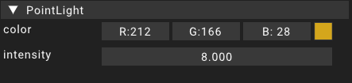

# PointLight

The pointlight component is a component picked up by the renderer.
This component adds a pointlight source using the transform information provided by the [transform](transform) component assigned to the same [entity](../entity).

For a point light the rotation and scale of the [transform](transform) are ignored. Only the position has an impact on the visuals.

## Properties

### Color

The color property contains the light color emitted from the pointlight.
Clicking the color icon on the right of the editor pops open a color picker.

### Intensity

The intensity property can be used to increase the light strength emitted by the pointlight.