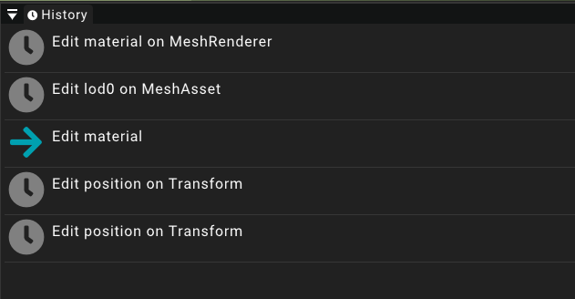

# History

The history widget is an integral part of the undo/redo system employed in the editor.

## Basic undo/redo

As any respectible application the LowEngine editor supports an undo/redo system.
This means it is possible for a user to revert recent changes.
Shortcuts for that purpose are the commonly used ones being _Ctrl+Z_ and _Ctrl+Y_ to redo the last undone action.
The top window also contains mouse support for the system by selecting the _Edit_ dropdown and choosing either the _Undo_ or _Redo_ option.

## History widget

To be able to keep track of the current changes on the undo-stack a widget is available.
The history widget shows all recent changes and also displays when some changes have been reverted by using the undo operation.

