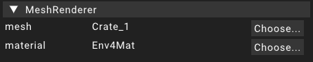

# MeshRenderer

The meshrenderer component is used to give entities a visual representation.
This component is being picked up by the renderer and contains the information needed to render a mesh to the screen
at the position contained in the [transform](transform) component assigned to the same [entity](../entity).

## Properties

The properties of the meshrenderer component hold the information needed for the renderer to be able to render a mesh with certain material information to the screen.

### Mesh

The mesh property of the meshrenderer contains the mesh that is supposed to be rendered as a visual representation of the [entity](../entity).
A meshasset is used as the value for this property.

:::tip
To assign a meshasset it is also possible to drag and drop a meshasset from the [asset widget](../widgets/assetwidget) to the _Choose..._ button of this property.
This works for all properties that reference another object.
:::

### Material

While the mesh is the only required property to have something being rendered to the screen, the material property can be used to assign material information to the object.