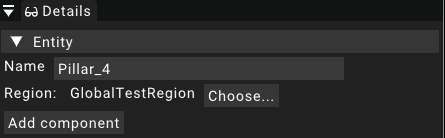

# Entity

This page explains the concept of the entity and its relation to components and systems.

## Basic concept

An entity represents one object placed in a scene.
It is nothing more than a functionality free data container that can be filled with different aspects using components.
Other engines that follow a more object-oriented architecture even name them "game object".

## Properties

The entity has just a few properties that are exposed and editable.

### Name

The name property contains the name of the entity.
It works mostly like a `string` but is internally represented using a `name`.
The name of the entity is used to identify it as the name is what is displayed in the list of the [scene widget](widgets/scenewidget).

### Region

The region property assigns the entity to a region.
This means that in case of a streamed region,
the entity will be removed when the assigned region is unloaded and reinitialized whe the region is loaded.

## Components

An entity can have multiple components assigned to it.
Additional components can be added using the _Add component_ button displayed in the [details widget](widgets/detailswidget).

Each entity automatically has a [transform](components/transform) component that gives the entity a transformation inside the game world.