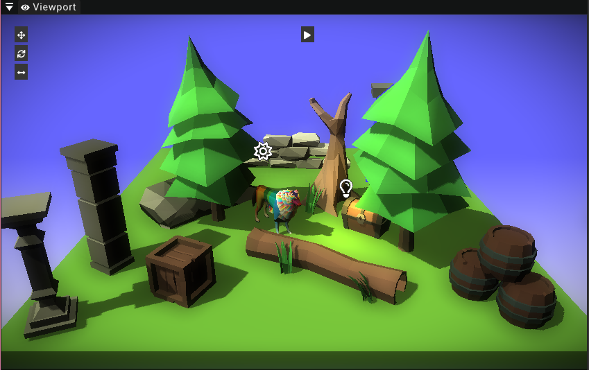

# Viewport

The viewport widget is the main editing widget of the LowEngine editor.
This widget displays the 3D scene and allows the user to edit entities directly in 3D.
When playtesting the game this widget will also be used to display the game while playing.

Therefore the viewport widget supports two modes: Editing and playing.
This section will mostly focus on the editing mode. Playmode is only used when playtesting the game in-editor.

## Moving the camera

This section explains how to move around the camera in edit mode.
It is possible to rotate the camera by holding down the right mouse button and moving around the mouse.
This controls similarly to first person games.

To actually move around the camera in 3D the WASD keys can be used.
The direction of movement will always be relative to the cameras orientation.
In order to be able to move up and down the Q and E keys can be used.
The mouse scrollwheel can be used to increase or decrease the camera's movement speed.

## Selecting entities

It is possible to hover and select [entities](../entity) in 3D.
However, this feature only works for [entities](../entity) that have the [MeshRenderer](../components/meshrenderer) component assigned to them.

## Entering/exiting playmode

On the top of the viewport widget there is a play button that allows the user to enter playmode.
Entering playmode removes all editing features like moving the camera and hovering/selecting entities.
This essentially just starts the game in-editor.
To exit playmode just use the same button that now displays a stop symbol.
This reloads all scenes and regions and puts the editor back in edit mode.

## Editing entities

Once an entity has been selected it is possible to move it around and edit its transformation values in 3D using gizmos.
This feature is only enabled in edit mode.
The selected entity will display translation (movement) gizmos at its center.
These arrows and faces can be grabbed with the mouse and used to move the entity around in 3D.

Other buttons in the top left of the viewport widget allow the user to switch to rotation and scaling gizmos.
These work similarly to the translation gizmos.

:::note
For all of the different transformation options the white center point of the gizmos will be used as the pivot point for the transformation.
:::

