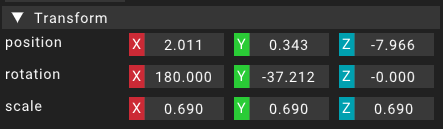

# Transform

The transform component is the most basic component provided in the engine.
Every [entity](../entity) has an instance of the transform component assigned to it.

The transform component contains all transformation info for the assigned [entity](../entity).
These are the _position_, _rotation_ and _scale_.
All of the information displayed in the transform component are local transformation.
This means that if the transform has a parent transform, then the transformation info shown on the child are relative to the parent's transformation.
Only transforms that do not have a parent on their own display world coordinates.

## Properties

The properties of the transform property can either be edited in the [details widget](../widgets/detailswidget) or using the transformation gizmos in the [viewport](../widgets/viewportwidget).

### Position

The position property contains the position relative to the transform's parent (or the world position if there is no parent assigned).
This value is represented as a three dimensional vector (Vector3).

### Rotation

The orientation of the transform is displayed in the rotation property. This value is also relative to the parent (or the world rotation).
While this property is internally represented as a quaternion,
in the details widget it is displayed as a vector3 which holds the euler angle representation of the rotation.

### Scale

The scale property contains the scaling relative to the transform's parent (or the absolute scale).
The three coordinates of the vector3 contain the scaling in the direction of each of the coordinate axis.