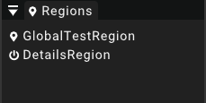

# Regions

The regions widget contains all currently loaded regions.
[Regions](../region) listed here can either be streamed in or streamed out.
The widget basically lists all regions assigned to the currently loaded scene.

The state of the region will be indicated by an icon displayed in the widget.
The icon will change as soon as a region gets streamed in/out.

To select a region it is possible to just click on any of the entries in the region widget.
The properties of the region will be displayed in the [details widget](detailswidget) for the currently selected region.

## Create region

To create a new region the use can just right click anywhere in the region widget at select the option _New region_
The newly created region will be automatically selected and assigned to the currently loaded scene.

## Delete regions

Any of the regions displayed in the region widget can be displayed by right-clicking its entry and selecting the option _Delete_.
This will remove the region entry from the list and delete the region from the scene.