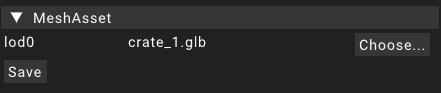

# MeshAsset

The mesh asset is an asset that is based on [mesh resources](assetresource#resources).
The most obvious use case for mesh assets is to assign them to the _mesh_ property of a [MeshRenderer](../components/meshrenderer) component to have them rendered to the screen.

Currently the LowEngine does not feature a LOD system for meshes but when it will be implemented the MeshAsset
will be the main place for the user to engage with it.
Right now the MeshAsset only has one property _lod0_ which just holds the MeshResource that should be rendered for the mesh.
Once a LOD system is implemented there will be multiple MeshResource properties available here that allow the user to put in resources for the other levels of detail.

Saving a MeshAsset will store its values in a file located in `/data/assets/meshes` in the corresponding subdirectory.
The file will be named using the unique id generated for the MeshAsset.