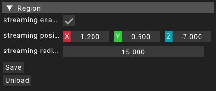

# Region

Regions are an important part of what makes LowEngine an engine suitable for open world games.
A region is a set of [entities](entity) that can be streamed in dynamically when the player camera comes close to the streaming position of the region.
Also the entities contained in a region will get streamed out when the player camera leaves the streaming area.
A cylinder has been chosen as a shape for the steaming area of a region.

Not all regions need to be streamed dynamically though.
Regions can also not be streamed at all which means that they will statically exist in the [scene](scene) wether the player is close to it or not.

A [scene](scene) can have multiple regions that will all be loaded when the [scene](scene) is started.
This does not mean that all streamed regions will get streamed in immediately.
The system will only stream in regions that are close enough to the player camera.

## Properties

The region holds a few relevant properties.
Pretty much all of them are related to streaming which means that for a non streamed region these properties will be ignored.

### Streaming enabled

This value will determine wether the region will be streamed in and out dynamically or not.
If this value is set to `false` the region will never be streamed out and only unloaded when the assigned scene gets unloaded.

### Streaming position

The _streaming position_ property holds the center of the streaming area.
The value is a _vector3_ in world coordinates.

### Streaming radius

This property holds the radius of the streaming cylinder.
The cylinder is centered at _streaming position_.

## Other options

Having a region open in the [details widget](widgets/detailswidget) also offers some other options presented as buttons.
If the selected region is streamed in it is possible to save the region which saves all of its properties and the assigned [entities](entity) to a files.
These files will be stored at `/data/assets/regions` and will be named using the unique id of the region.

Another option available if the region is streamed in is the _unload_ button.
This will stream out all of the assigned entities of the region.
If the region is streamed out however the button _load_ will be shown that streams in all of the region's [entities](entity).

## Viewport visuals

When a streamed region is selected using the [region widget](widgets/regionwidget) there will also be some helpful visuals displayed in the [viewport](widgets/viewportwidget).
A little icon will be displayed at the _streaming position_ for the region.
The region streaming range will also be visualized by a large yellow wireframe cylinder that is only visible from outside the cylinder.

