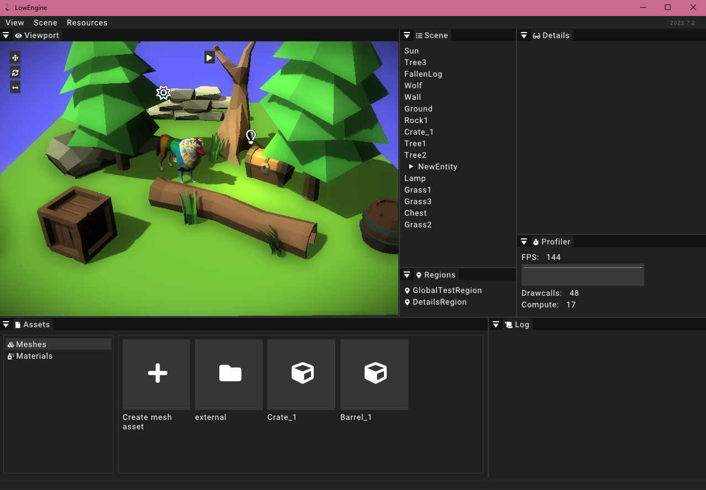

# User interface

This part of the documentation explores the different windows and screens of the LowEngine editor.

This screenshot shows the LowEngine editor with all available widgets open. In the following sections we will discuss the general layouting options that the editor provides. 

## Layouting options

The LowEngine editor allows for a lot of layout customization options. Every widget can be grabbed with the mouse and moved around freely. Hovering a widget while dragging one will display different docking options. The layout is saved automatically and will get reinitialized when the editor is restarted.

## Hiding/showing widgets

It is also possible to hide and show certain widgets using the _View_ menu at the top of the screen. Hiding/showing a widget is currently not a setting that is being saved.

## Other info

There are a few other parts of the layout worth mentioning. The most obvious would be the menu on the top. The menu options are discussed in more detail in the menu section.

Other than that the current version of the engine is displayed on the top right of the screen. The versioning follows the following pattern: `YEAR.MONTH.PATCH`. The patch number gets incremented for each build (reset when the month changes).

On the bottom of the screen there is another small bar that is in some cases used to display an indicator when the editor is loading.