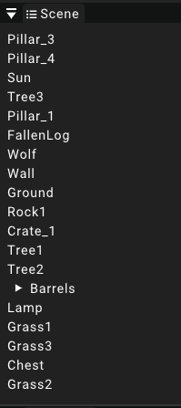
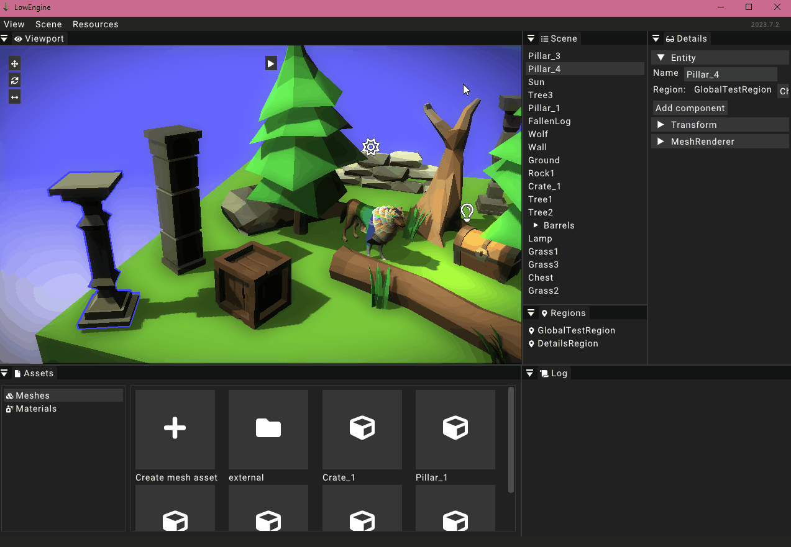

# Scene 

The scene widget displays a list of all the currently loaded [entities](../entity). The entities are listed in no particular order.
Unloading a region or switching the scene entirely will remove the assigned entities from the list.

The entities in the list are displayed by their name. To select an entity and be able to
view their properties in the [details widget](detailswidget) it is possible to just click on one of the entries.

## Creating entities

In order to create a new entity just right click anywhere in the scene widget and select the option _New entity_.
The new entity will be created without any components with the name "NewEntity".
It is automatically selected and opened in the [details widget](detailswidget).

Another way to create new entities is to duplicate an existing one. To do so just right click on any existing entry in the list and select _Duplicate_. Alternatively you can use the `Ctrl+D` shortcut.
The new entity will copy over all components and properties from the selected entity and will automatically be opened into the [detail widget](detailswidget).

## Deleting entities

In order to delete an entity from the list just rightclick its entry and select the `Delete` option. The entity will then be removed from the list and the runtime entirely.

## Transform hierarchy

Details of the transform hierarchy will be explained in the [transform](../components/transform) section.
To assign an entity as a child of another entity just simply drag and drop its entry onto the parent entry.
This will create a dropdown tree structure for the parent which lists all of its children under it.
It is possible to nest these trees deeper than just one level.
In order to unassign a child from its parent just drag its entry onto empty space in the scene widget.

:::caution
Circular relations are not allowed and will most likely lead to the engine crashing.
:::

