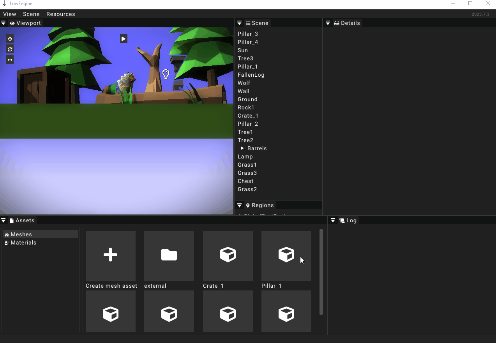

# Assets & Resources

This section explains the concept of assets and resources in LowEngine.
Please note that the distinction made here is specific to this engine and is not a general concept for other game engines.

## Resources

Any data that is created and edited in 3rd party software like blender and photoshop is considered a resource in LowEngine.
This includes 3D models, textures and sounds that are created outside of the engine's editor.

### Importing meshes

To import a mesh resource (3D models) the top menu _Resources_ can be used.
The suboption _Import_ opens a file explorer window.
Only wavefront `.obj` files are supported for importing 3D models.
Just select the file you want to import using the file explorer.
Once the import has concluded a message will be displayed in the [log widget](../widgets/logwidget).

It is also possible to reimport a mesh that has been updated.
If this mesh is already loaded the engine might need to be restarted in order to load the new version of the mesh.

Importing a mesh converts the format to `.glb` and stores it in `/data/resources/meshes`.

### Importing textures

To import a texture resource the top menu _Resources_ should be used.
The suboption _Import_ opens a file explorer window.
Importing textures only supports `.png` files.
Just select the file you want to import using the file explorer.
Once the import has concluded a message will be displayed in the [log widget](../widgets/logwidget).

It is also possible to reimport a texture that has been updated.
If this texture is already loaded the engine might need to be restarted in order to load the new version of the texture.

Importing a texture converts the format to `.ktx` and stores it in `/data/resources/img2d`.

## Assets

The term asset is used to refer to any kind of data that is created and edited using the LowEngine editor.
For the most part the internal systems of the engine do not work with resources but assets.
This means that even for imported resources usually an asset has to be created to use them in components or other systems.