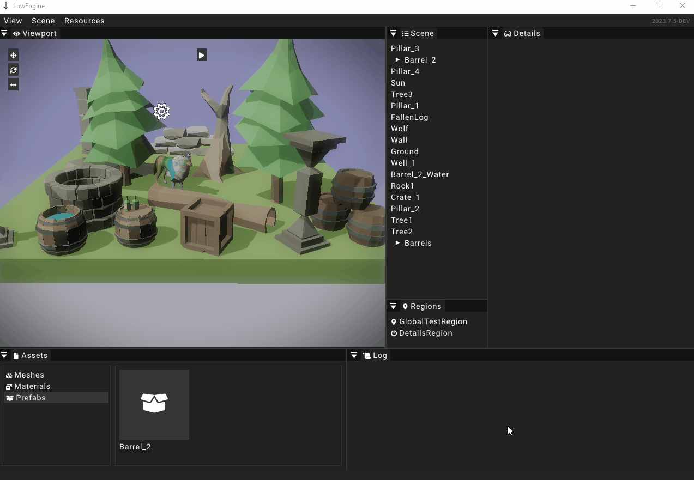

# Prefab

Prefabs are also listed as part of assets and will are also managed alongside [MeshAssets](meshasset) and [Materials](material) in the [asset widget](../widgets/assetwidget).
The idea of prefabs is to have a template to create entities from.
Prefabs can be created from [entities](../entity) and then spawned into the [scene](../scene).
They store all the data of the [entity](../entity) and the assigned [components](../components/component) and the decendant entities.

## Creating entities

To create a prefab just drag an [entity](../entity) from the [scene widget](../widgets/scenewidget) into the [asset widget](../widgets/assetwidget).
Just make sure to select the _Prefabs_ category before.
Doing this creates a new prefab and saves it to a file located in `/data/assets/prefabs`.
The file will use the unique id of the prefab as the filename.

## Spawning prefabs

To spawn an instance of a prefab into a scene just drag and drop the prefab from the [asset widget](../widgets/assetwidget) into the [scene widget](../widgets/scenewidget).
The [entity](../entity) will automatically be added to the global [region](../region) of the [scene](../scene).
The entity's [transform](../components/transform) will be zeroed out which means that the entity will spawn at the center of the [scene](../scene).

## Editing prefab instances

It is possible to make changes to the instance of a prefab.
Making changes to one instance of a prefab does not make changes to any other of the prefab instances automatically.
Doing this just marks the edited property as different from the prefab.
Making changes to the prefab on the same properties later on will not override the changes made to the prefab instance in that case.

However, it is possible to apply the changes made to an instance of a prefab to the prefab itself.
This will apply the same change to all instances of the prefab as long as the same property had not been overriden on the instance before.

