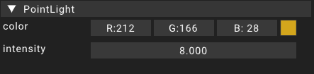

# DirectionalLight

The directionallight component is a component picked up by the renderer.
This component adds a directional light source using the transform information provided by the [transform](transform) component assigned to the same [entity](../entity).

A directional light is usually used to represent sunlight. It mimics constant light coming from a certain direction without a specific origin point.

For a directional light the position and scale of the [transform](transform) are irrelevant. Only the rotation is important for the visuals.

## Properties

### Color

The color property contains the light color emitted from the pointlight.
Clicking the color icon on the right of the editor pops open a color picker.

### Intensity

The intensity property can be used to increase the light strength emitted by the pointlight.