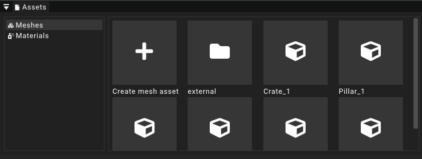

# Assets

The asset widget provides an explorer for the different kinds of assets managed by the engine.
On the left of the widget there is a list of all available asset types that can be managed using the widget.

This section merely discusses the functionality of the asset widget and not the different asset types themselves.
Please refer to their respective section to learn more about them.

## Creating new assets

Each of the categories featured in the asset widget provide a button to create a new asset.
This button prompts the user with a name for the newly created instance. 
These names need to be unique per asset type.

## Editing assets

The assets for each category are listed in the asset widget with their name being displayed right under a descriptive icon.
Clicking on any of these entries in the list will open the selected asset in the [details widget](detailswidget.mdx) and list all of its editable properties.

## Delete assets

:::note
This feature is currently only supported for mesh assets.
:::
To delete an asset users can just right click an entry in the list and select the _Delete_ option.

## Directory structure

:::note
This feature is currently only supported for mesh assets.
:::
The asset widget will take the directory structure for the different asset types into account.
It is possible to navigate into a directory by clicking on its entry in the list.
When the user is currently in a subfolder of the root directory for the selected asset type an editional entry is displayed that allows the user to exit the current directory.

When a new asset instance is created while currently navigated in a subdirectory the current path will be chosen for the asset's destination.
It is also possible to move assets between directories by dragging and dropping their entries on a directory.