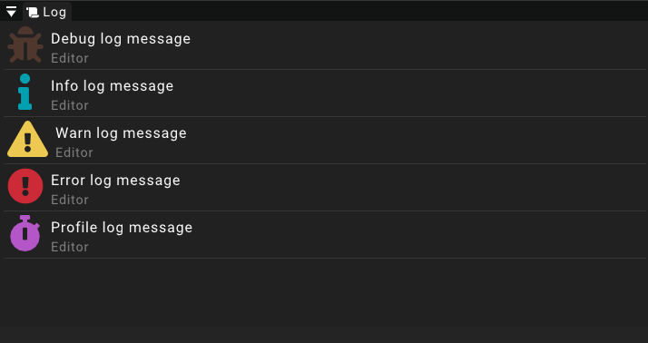

# Log

The log widget displays current events and messages from the engine that can be used for debugging or just as a means of communication.
The messages displayed in this widget are a subset of the messages logged by the engine.

## Messages

Each message displayed in the widget has a type. This type can either be _debug_, _info_, _warn_, _error_ or _profile_.
The type of the missage is displayed using the colored icon.
Besides that each message has a content and also displays the source of the message below the content.

:::note
The logwidget has a maximum amount of messages that can be displayed at a time.
If the buffer is full and a new message is posted, the oldest message gets removed from the widget to make space for the new one.
:::