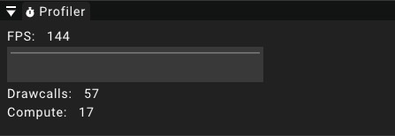

# Profiler

The profiler widget displays some basic profiling information at runtime.

## Frames per second

The current frames per second (FPS) is a metric displayed in the profiler widget.
It shows how many images are renderer per second.
This value is currently capped to 144.
Significant drops can be observed using the graph that displays the values of the previous seconds.

## Drawcalls

The drawcalls metric shows how many draw commands are send to the GPU per frame.

## Compute

This metric shows how many compute shaders are dispatched per frame on the GPU.